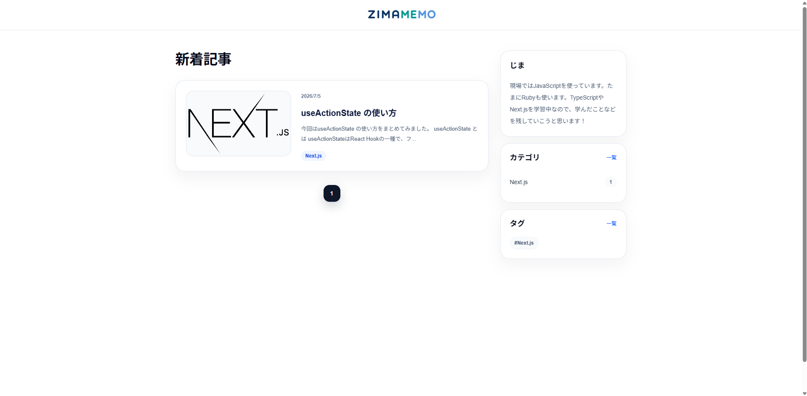

# zimamemo

Next.js と Prisma で構築した個人ブログ向け CMS です。  
公開サイトと管理画面を備え、Markdown 形式の記事を管理できます。

**デモ**: https://your-demo-url.vercel.app

## 主な機能

- 記事の作成・編集・削除、公開/下書き管理
- カテゴリ・タグの管理（多対多）
- 画像のアップロード・管理（Vercel Blob）
- プロフィールページの管理
- 管理者ログインとログイン試行回数の制限

## 技術構成

- **フロントエンド**: Next.js 16 / React 19 / TypeScript
- **スタイリング**: Tailwind CSS 4
- **データベース**: PostgreSQL / Prisma 7
- **ストレージ**: Vercel Blob

## スクリーンショット

<!-- 管理画面と公開サイトのスクリーンショットをここに追加 -->
